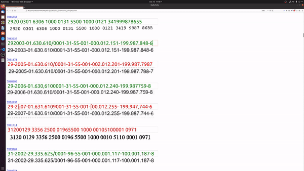

# Cotas Pralamentares Scraping

## Funcionalidades

Código utilizado para:
- Processar dados relativos à [cota para o exercício da atividade parlamentar](https://www.camara.leg.br/cota-parlamentar/)
- Extrair dados relativos às notas fiscais relacionadas a cada despesa:
  - Chave das NFs
  - Dados gerais da nota (quando o documento fornecido pelo site da câmara perimitir)
- Fazer o download das notas fiscais relacionadas a cada despesa, quando necessário
- Fazer o download de cupons fiscais referênciados nas notas fiscais
- Extrair dados das notas e cupons baixados
- Processar dados extraídos, com o objetivo de identificar possíveis irregularidades
- Gerar relatórios com os dados extraídos

## Configurando
O código só foi testado para uso, para rodar em outros sistemas operacionais, serão necessárias adaptações ao código

### Configurando arquivo .env
Inicialmente deve-se copiar o arquivo ".env.sample" para ".env"

Nesse arquivo devem ser preenchidas as variáveis de ambiente.

#### Google Vision API
Para utilizar o recochecimento de texto dos PDFs, deve-se [obter uma chave para o Vision Api](https://cloud.google.com/vision/docs/setup), do goolge. O serviço é gratuito para até 1000 requisições mensais, acima dessa quantidade há um custo de 1,5 dólares para cada mil requisições. Esse custo pode ser abadito dos 300 dólares de crédito que a Google fornece para o primeiro ano de uitilização dos serviços.

Caso não seja configurada uma chave para o api, as chaves de algumas NFs deverão ser inseridas manualmente.

#### ANTI-CAPTCHA API
Para utilizar os serviços de resolução de captcha, deverá ser obtida uma chave para o API do site [ANTI-CAPTCHA](https://anti-captcha.com/mainpage). O uso do serviço fica entre 1 e 2 dólares para cada 1000 captchas resolvidos.

Caso não seja configurada nenhuma chave para a resolução dos captchas, esses deverão ser resolvidos manualmente pelo usuário.

### Inicializando container
Na raíz do projeto, deve-se criar o container do banco de dados
```bash
docker-compose up --no-start
```
Após a criação basta inicializálo
```bash
docker-compose start
```

### Inserindo dados das cotas parlamentares (obtidos do [site da câmara](https://dadosabertos.camara.leg.br/swagger/api.html#staticfile)) no bando de dados
```bash
./nfDownloader json-to-db \<ARQUIVO JSON\>
```

## Utilização

#### Fazer donwload de arquivos relativos às despesas dos parlamentares
```bash
./nfDownloader donwload-doc-files \<JSON COM IDS DOS DOCUMENTOS\>
```

#### Localizar chave das NFs nos documentos baixados, em formato PDF
```bash
./nfDownloader find-keys \<JSON COM IDS DOS DOCUMENTOS\>
```

O códgio tenta localizar o texto com a chave no PDF, caso isso não seja possível (porque o PDF é formado por imagens, por exemplo) o PDF será aberto. O usuário deverá, então, tirar um print screen da área em que o texto da chave se encontra, e apertar as teclas CTRL+SHIFT+ALT, para que o programa possa continuar rodando. O código usuará uma API da Google para extrair o texto da imagem e repetirá o processo para as próximas notas fiscais.


#### Verificação das chaves extraídas dos PDFs
```bash
./nfDownloader gen-key-html \<JSON COM IDS DOS DOCUMENTOS\>
```

A extração da chave das NFs através de imagens pode conter erros. Para verificar e corrigir esses erros, é possível gerar um arquivo HTML, onde o usuário poderá conferir os dados extraídos. Para facilitar esse processo, o texto da chave fica vermelho quando o número de digitos ou o digito verificar não estiverem corretos. Ao final do processo o usuário pode baixar um arquivo json com os novos dados, para serem atualizados no banco de dados.



#### Atualiza chave das notas fiscais no banco de dados, baseado em arquivo json
```bash
./nfDownloader process-key-data \<JSON COM IDS DOS DOCUMENTOS\>
```

#### Baixa notas fiscais, baseado em arquivo json com lista de chaves
```bash
./nfDownloader donwload-nf-list \<JSON COM CHAVE DAS NFs\>
```

#### Baixa notas fiscais, baseado em arquivo json com lista de documentos relacionados
```bash
./nfDownloader donwload-doc-list \<JSON COM IDS DOS DOCUMENTOS\>
```

#### Baixa cupons fiscais referenciados em NFs, baseado em arquivo json com lista de documentos relacionados
```bash
./nfDownloader donwload-doc-children \<JSON COM IDS DOS DOCUMENTOS\>
```

#### Processa notas fiscais, baseado em arquivo json com lista de chaves
```bash
./nfDownloader process-nfs \<JSON COM CHAVE DAS NFs\>
```

#### Processa notas fiscais, baseado em arquivo json com lista de documentos relacionados
```bash
./nfDownloader process-docs \<JSON COM IDS DOS DOCUMENTOS\>
```

#### Processa cupons fiscais referenciados em NFs, baseado em arquivo json com lista de documentos relacionados
```bash
./nfDownloader process-docs\<JSON COM IDS DOS DOCUMENTOS\>
```

#### Gera relatório, baseado em arquivo json com lista de documentos
```bash
./nfDownloader generate-report\<JSON COM IDS DOS DOCUMENTOS\>
```
